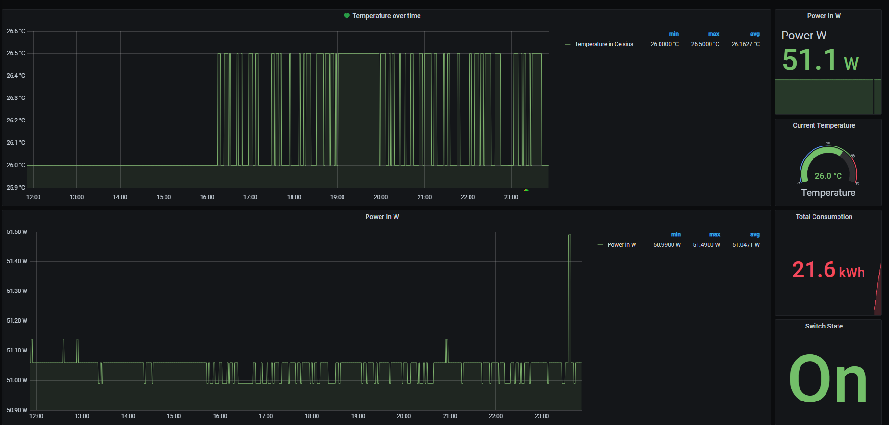

<div align="center">

<p align="center">
  <a href="https://github.com/ferenconvonmatterhorn/fritzdect-prom-exporter">
    
  </a>

  <h3 align="center">FritzBox Dect Prometheus Exporter</h3>
</p>

</div>


[](https://codecov.io/gh/FerencoVonMatterhorn/prometheus-fritzdect-exporter)

## Prerequisites - Creating the FRITZ!Box User <a name="prerequisites"></a>
        
### 1. Creating a user account with the right to configure FRITZ!Box settings  
Create at least one user account that you can access the FRITZ!Box settings with:  
1. Click "System" in the FRITZ!Box user interface. 
2. Click "FRITZ!Box Users" in the "System" menu. 
3. Click the "Add User" button. 
4. Enable the option "User account enabled". 
5. Enter a user name, a valid email address, and a password for the user. 
6. Enable the option "Access from the internet allowed" if the user may also access the FRITZ!Box over the internet. 
7. Enable the option "FRITZ!Box settings" under "Rights". You can assign additional rights according to your individual needs. 
8. Click "OK" to save the settings. 

### 2. Setting up users with restricted authorization
1. Click "System" in the FRITZ!Box user interface. 
2. Click "FRITZ!Box Users" in the "System" menu. 
3. Click the "Add User" button. 
4. Enable the option "User account enabled". 
5. Enter a user name, a valid email address, and a password for the user. 
6. Enable the option "Access from the internet allowed" if the user may also use the FRITZ!Box services for which he is authorized over the internet. 
7. Disable the option "FRITZ!Box settings" under "Rights" because otherwise the user can access all of the settings. 
8. Assign additional rights according to the individual needs of the user. 
9. Click "OK" to save the settings.

### 3. Enabling login to the home network with user name and password
After you have created the users with the desired rights, enable login to the home network with the user accounts:  
1. Click "System" in the FRITZ!Box user interface 
2. Click "FRITZ!Box Users" in the "System" menu. 
3. Click on the "Login to the Home Network" tab. 
4. Enable the option "Login with FRITZ!Box user name and password". 
5. Click "Apply" to save the settings. 


## How to use it <a name="howto"></a>
# docker
```bash
$docker run -p 2112:2112 ferenco42/fritzdect-prom-exporter:v1 -u <username> -p <password> -l <loglevel> -i <interval>
```
# docker-compose
```yaml
version: '3.3'

services:
  fritzdect-prom-exporter:
    container_name: fritzdect-exporter
    image: ferenco42/fritzdect-prom-exporter:v1
    ports:
      - 2112:2112
    command:
      - '-u=<username>'
      - '-p=<password>'
      - '-l=<loglevel>'
      - '-i=<interval>'
```
## Grafana dashboard example <a name="grafana dashboard"></a>



